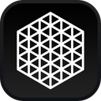

<h1 align="center">Crystal</h1>

<p align="center"></p>

<p align="center">Open-source AI client for Ollama, Groq, Anthropic and OpenAI</p>

<p align="center">
  <a href="https://x.com/ctatedev"></a>
  <a href="https://github.com/ctate/crystal"></a>
</p>

## Features

- **Native Performance**: Built with Swift for optimal performance on Apple devices.
- **Extensive Integrations**: Connects with APIs from various services for a versatile functionality.
- **Privacy-First**: Direct interactions with services using personal API keys, ensuring data privacy.
- **Open-Source**: Community-driven development inviting contributions.

## Providers

- [Anthropic](https://anthropic.com)
- [Groq](https://groq.com)
- [Ollama](https://ollama.com)
- [OpenAI](https://openai.com)

## Integrations

- Google
- Hacker News
- Wikipedia
- Weather.gov

## Getting Started

Follow these instructions to get Crystal set up on your device for development and testing purposes.

### Prerequisites

Ensure you have the latest version of Xcode installed, which you can [download](macappstore://itunes.apple.com/app/id497799835) from the Mac App Store.

## Installation

A step-by-step guide to setting up your development environment:

1. **Clone the repository**

   ```bash
   git clone https://github.com/ctate/crystal.git
   cd crystal
   ```

2. **Open the project in Xcode**

   Open the `Crystal.xcworkspace` file in Xcode to view and edit the project.

3. **Run the application**

   Select the target device from the top device toolbar and hit the **Run** button.

## Usage

Here's how you can start using Crystal:

1. **Configure your API keys** in the app settings.

2. **Interact with Crystal** through the user-friendly interface or programmatically via Swift functions.

## Contributing

Interested in making Crystal better? Contributions are welcome! Please refer to [CONTRIBUTING.md](CONTRIBUTING.md) for our contribution guidelines and code of conduct.

## License

This project is licensed under the Affero General Public License (AGPL) - see the [LICENSE.md](LICENSE.md) file for details.
